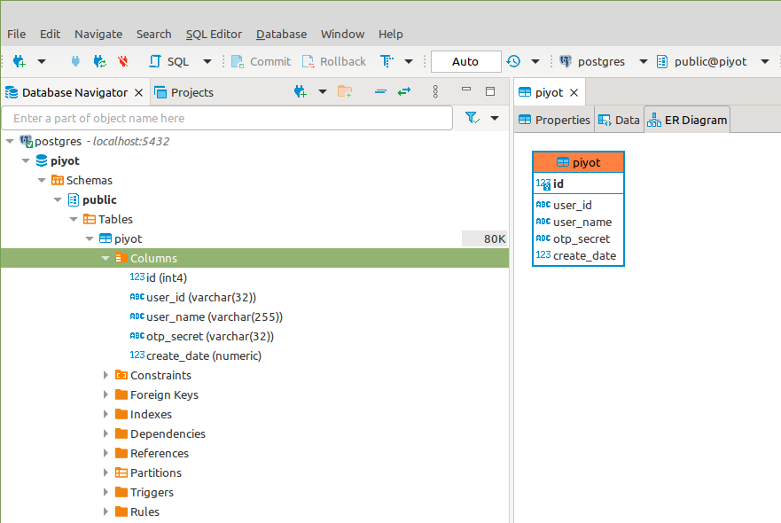
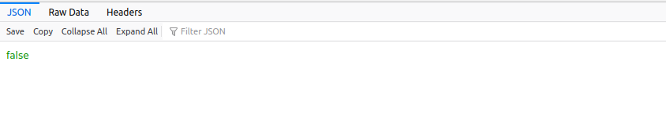
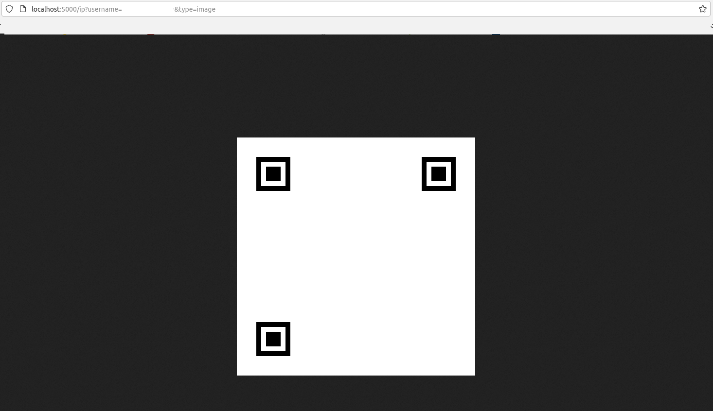
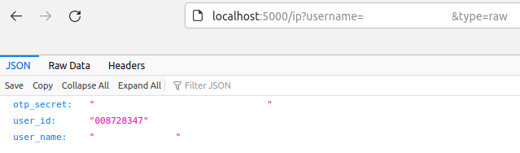

## Piyot
#### otp microservice implemented in python
####
OTP is a common method for generating and verifying one-time passwords. It can be used to implement two-factor (2FA) or multi-factor (MFA) authentication methods in web applications and in other systems that require users to log in.

Piyot is an OTP microservices with the following functions: ✨
* Provide OTP Validation
* Generate QR Code (Google Authenticator/FreeOTP etc.)
* Keep Users Secret in  DB (Flask SQLAlchemy)

##### Usage (Local)
# 
##### 0. Run postgresql
# 
```
docker run -d \
  --name postgres \
  -p 5432:5432    \
  -e POSTGRES_PASSWORD=mysecretpassword \
  -e PGDATA=/var/lib/postgresql/data/pgdata \
  -v postgres:/var/lib/postgresql/data \
  postgres
```

##### 1. Create DB with the following table and example User
# 
```
CREATE TABLE IF NOT EXISTS piyot (
    id INTEGER NOT NULL GENERATED BY DEFAULT AS IDENTITY PRIMARY KEY,
    user_id VARCHAR(32) UNIQUE NOT NULL,
    user_name VARCHAR(255) UNIQUE NOT NULL,
    otp_secret  VARCHAR(32) UNIQUE NOT NULL,
    create_date NUMERIC DEFAULT extract(epoch from now() at time zone 'UTC')
);
INSERT INTO piyot (user_id,user_name,otp_secret,create_date) VALUES 
	 ('008728347','user_name','SECRET_HERE',98729817987);
```
<p></a>

##### 2. Run Piyot
##

```
docker run -d \
  -p 5000:5000 \
  -e PIYOT_DB_URI="postgresql://${USER}:${PASSWORD}@${DB_HOST}:${DB_PORT}/${DB_NAME}" \
  alphaceti/piyot
```

##### 3. Validate and Get
##

Validation:
```
localhost:5000/ip?username=${USERNAME}&otp=${OTP_CODE}
```

<p></a>

Get QR Code (PNG):
```
http://localhost:5000/ip?username=${USERNAME}&type=image
```

<p></a>

Get User Data (Json):
```
http://localhost:5000/ip?username=${USERNAME}&type=raw
```

<p></a>
